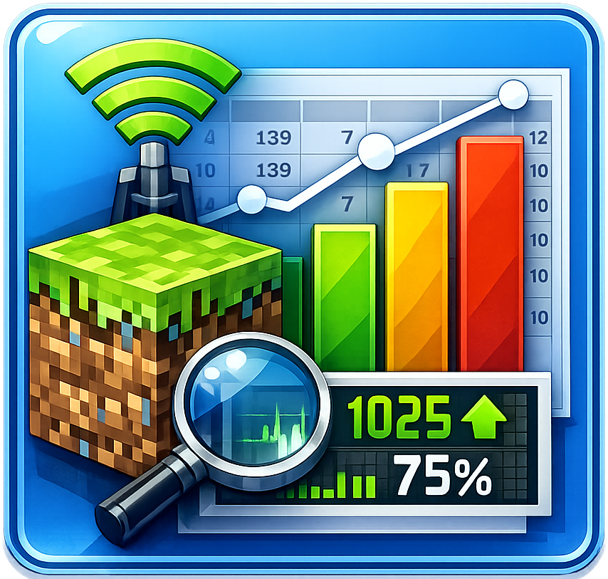

<div align="center">

# MineTrack - Minecraft Server Data Statistics

**Vue 3 + Flask layered architecture Minecraft server data statistics panel**

[](https://opensource.org/licenses/MIT)
[](https://www.python.org/)
[](https://flask.palletsprojects.com/)
[](https://vuejs.org/)
[](https://www.typescriptlang.org/)
[](https://vitejs.dev/)
[](https://pinia.vuejs.org/)
[](https://echarts.apache.org/)
[](https://tailwindcss.com/)
[](https://ringontheway.github.io/minetrack/)



**[简体中文](README.md)** **| English**

⭐ If you like this project, please give it a Star on GitHub — Thank you!

[Features](#features) • [Quick Start](#quick-start) • [API Endpoints](#api-endpoints) • [Tech Stack](#tech-stack) • [Project Structure](#project-structure) • [Frontend Routes](#frontend-routes)

</div>

***

## Overview

MineTrack is a Minecraft server data statistics panel built with Vue 3 + Flask layered architecture, supporting two modes: local data scanning import and static page deployment. It covers comprehensive data visualization including map size trends, player statistics, battle statistics, item crafting, item pickups/drops/usage, and player activity statistics. Features dark mode, 9 theme color presets, and bilingual (Chinese/English) support.

## Features

### Dashboard

- 📊 Overview: total days, player count, date range (with number counting animation)
- 📈 Quick navigation to all statistics pages (with hover scale animation)
- 🗺️ Latest map sizes at a glance (with pulse animation indicators)
- 📉 Map size trend line chart (with growth rate)

### Map Statistics

- 📈 Map size trends (Overworld / Nether / End line charts with area fill)
- 🔍 Multi-player filtering and comparison
- 📊 Real-time growth rate calculation

### Player Statistics

- 👥 6 core metrics: play time (hours), deaths, mob kills, player kills, jumps, walk distance (km)
- 📊 Line charts with stat type switching
- 🔍 Multi-player filtering and comparison (golden angle distribution colors)

### Battle Statistics

- ⚔️ Mob kill ranking (filtered by player)
- 🛡️ Killed by mob ranking
- 🏆 Top 10 mob statistics (with 76+ mob name translations)
- 🥇 Medal-style highlighting for top 3

### Item Crafting

- 🔨 Crafting statistics (crafted / used categories)
- 📊 Date trend bar chart + Top 10 items ranking
- 👤 Multi-player filtering support
- 🌐 740+ item name translations

### Item Statistics

- 📦 Item pickups / drops / usage (picked\_up / dropped / used)
- 📈 Date trend bar chart + Top 10 ranking
- 👤 Multi-player filtering support

### Activity Statistics

- 🏃‍♂️ 9 activity types: sprint, walk, fly, climb, swim, horse, boat, elytra, fall
- 📊 Date trend bar chart with activity type switching
- 👤 Multi-player filtering support

### Data Management (Local Mode)

- 📂 Single scan import: enter path or use folder browser to select server folder
- 📁 Batch scan import: auto-detect dates from `server.properties`
- 🗂️ Folder browser: drive selection, directory navigation, inaccessible directory markers
- 🗑️ Delete by date: custom calendar popup selector
- 🧹 Batch delete: date range selector
- ⚠️ Delete all data (with confirmation dialog)

### Player Import Filter

- 🔀 Master switch: disabled by default; when enabled, players are automatically filtered during data import
- ⏱️ Minimum playtime: players below the threshold are filtered out (default 1 hour)
- ✅ Whitelist: when configured, only whitelisted players are imported; all others are excluded
- ❌ Blacklist: blacklisted players are always excluded (mutually exclusive with whitelist; adding to one auto-removes from the other)
- 📊 Scan result feedback: filtered player count shown after import

### Personalization Settings

- 🎨 9 theme color presets (Emerald / Amber / Teal / Rose / Sky / HotPink / Gold / Navy / Crimson)
- 🌙 Dark mode (follows system preference or manual toggle)
- 🌐 Bilingual switching (language preference persisted to localStorage)
- 📊 Chart total display toggle
- 👥 Legend player count: set the maximum number of player data lines shown in charts (default 10)
- 🔀 Player import filter: master switch, minimum playtime, whitelist, blacklist (see "Player Import Filter" above)

## Quick Start

### Requirements

- **Python** >= 3.9
- **Node.js** >= 18
- **uv** ([Installation Guide](https://docs.astral.sh/uv/getting-started/installation/))

### Option 1: One-Click Start (Windows)

Double-click `start.bat` to automatically check dependencies, start backend and frontend servers, and open the browser.

### Option 2: Manual Start

#### 1. Initialize Backend

```bash
uv sync
```

#### 2. Start Backend Server

```bash
uv run python backend/main.py
```

Backend runs at `http://localhost:5000`.

#### 3. Initialize and Start Frontend

```bash
cd frontend
npm install
npm run dev
```

Frontend runs at `http://localhost:5173`, automatically proxying API requests to the backend.

#### 4. Export Static Data for GitHub Pages

```bash
uv run python scripts/export_data.py
```

Deploy `frontend/dist/` to GitHub Pages.

> In static mode, the frontend loads data from `data.json`. Data management features are not available.

## API Endpoints

| Method | Path                                          | Description                                                                                         |
|:------ |:--------------------------------------------- |:--------------------------------------------------------------------------------------------------- |
| GET    | `/api/dates`                                  | Get all recorded dates                                                                              |
| GET    | `/api/map_sizes`                              | Get map size data                                                                                   |
| GET    | `/api/player_stats?type=`                     | Get player stats (16 types, see below)                                                              |
| GET    | `/api/stats/:domain?category=`                | Detail stats (domain: battle/craft/item)                                                            |
| GET    | `/api/stats/:domain/summary?category=&limit=` | Stats summary Top N (default limit=10)                                                              |
| GET    | `/api/browse?path=`                           | Browse directories (Windows drive enumeration)                                                      |
| POST   | `/api/scan`                                   | `{"folder":"..."}` Scan a single folder                                                             |
| POST   | `/api/batch_scan`                             | `{"parent_folder":"..."}` Batch scan parent folder                                                  |
| POST   | `/api/export`                                 | Export data to JSON                                                                                 |
| DELETE | `/api/delete_date`                            | `{"date":"..."}` Delete data for a date                                                             |
| DELETE | `/api/batch_delete`                           | `{"dates":["...","..."]}` Batch delete dates                                                        |
| DELETE | `/api/delete_all`                             | Delete all data                                                                                     |
| GET    | `/api/settings`                               | Get all settings (filter_enabled / min_playtime_hours / whitelist / blacklist / max_legend_players) |
| POST   | `/api/settings`                               | Update settings (allowed keys same as above)                                                        |

> Backward compatible: `/api/battle_stats`, `/api/craft_stats`, `/api/item_stats`, `/api/battle_summary` are still available, all mapped to the unified `/api/stats/:domain` interface.

**player\_stats supported type values:** `play_time`, `deaths`, `mob_kills`, `player_kills`, `jumps`, `damage_dealt`, `distance_walked`, `sprint_one_cm`, `walk_one_cm`, `fly_one_cm`, `climb_one_cm`, `swim_one_cm`, `horse_one_cm`, `boat_one_cm`, `aviate_one_cm`, `fall_one_cm`

## Data Export

```bash
uv run python scripts/export_data.py
```

Reads from `minetrack.db` and exports to `data.json`.

## Tech Stack

| Component            | Technology                            |
|:-------------------- |:-------------------------------------:|
| Frontend Framework   | Vue 3 + TypeScript (Composition API)  |
| Build Tool           | Vite 5                                |
| CSS Framework        | Tailwind CSS 4                        |
| Chart Library        | ECharts 6 + vue-echarts               |
| Animation Library    | @vueuse/motion                        |
| Icon Library         | Lucide Icons                          |
| Internationalization | vue-i18n                              |
| State Management     | Pinia                                 |
| Backend              | Python Flask 3 (Layered Architecture) |
| Database             | SQLite (WAL Mode)                     |
| Package Manager      | uv (Python) + npm (Node.js)           |
| Deployment           | Flask local server / GitHub Pages     |

## Project Structure

```
stat/
├── frontend/                          # Vue 3 + Vite Frontend
│   ├── src/
│   │   ├── main.ts                    # Vue entry point (with localStorage locale)
│   │   ├── App.vue                    # Root component
│   │   ├── router/index.ts            # Vue Router (Hash mode)
│   │   ├── stores/
│   │   │   ├── app.ts                 # Global state (mode/dark mode/theme color/chart settings/legend count)
│   │   │   └── data.ts                # Statistics data state (dual-mode loading)
│   │   ├── services/
│   │   │   ├── api.ts                 # API call layer (auto-switch local/static mode)
│   │   │   └── usePlayerFilter.ts     # Player filter composable
│   │   ├── i18n/
│   │   │   ├── index.ts               # vue-i18n configuration
│   │   │   ├── zh-CN.json             # Chinese translations
│   │   │   ├── en-US.json             # English translations
│   │   │   ├── mobs.ts                # 76+ mob name translations
│   │   │   └── items.ts               # 740+ item name translations
│   │   ├── components/
│   │   │   ├── AppLayout.vue          # Layout container
│   │   │   ├── Sidebar.vue            # Sidebar navigation (locale/dark mode toggle)
│   │   │   ├── TopBar.vue             # Top navigation bar
│   │   │   ├── ChartContainer.vue     # ECharts chart container
│   │   │   └── PlayerFilter.vue       # Player filter component
│   │   └── pages/
│   │       ├── DashboardPage.vue      # Dashboard overview
│   │       ├── MapStatsPage.vue       # Map statistics
│   │       ├── PlayerStatsPage.vue    # Player statistics
│   │       ├── BattleStatsPage.vue    # Battle statistics
│   │       ├── CraftStatsPage.vue     # Crafting statistics
│   │       ├── ItemStatsPage.vue      # Item statistics
│   │       ├── ActivityPage.vue       # Activity statistics
│   │       ├── DataImportPage.vue     # Data management (import/delete)
│   │       └── SettingsPage.vue       # Personalization settings
│   ├── public/
│   ├── index.html
│   ├── package.json
│   ├── vite.config.ts
│   └── tsconfig.json
│
├── backend/                           # Flask Layered Backend
│   ├── app.py                         # Flask app factory
│   ├── config.py                      # Configuration management
│   ├── main.py                        # Entry point
│   ├── database/
│   │   ├── __init__.py
│   │   ├── init.py                    # Database initialization + Schema
│   │   └── repositories.py           # Repository data access layer
│   ├── services/
│   │   ├── parser.py                  # Universal stats parser
│   │   ├── scanner.py                 # Server folder scanner
│   │   └── exporter.py               # Data export service
│   └── routes/
│       └── api.py                     # All API Blueprint routes
│
├── locales/                           # Standalone translation files (static mode)
│   ├── zh-CN.json
│   └── en-US.json
├── scripts/
│   ├── export_data.py                 # Data export script
├── assets/
│   └── icon.png
├── minetrack.db                       # SQLite database
├── data.json                          # Exported static data
├── start.bat                          # Windows one-click start script
├── pyproject.toml                     # UV project configuration
├── .gitignore
├── README.md
└── README-EN.md
```

## Architecture Design

### Backend Layers

```
routes/api.py     ← HTTP request handling (Flask Blueprint)
    ↓
services/         ← Business logic (parsing / scanning / exporting)
    ↓
database/         ← Repository pattern data access layer
    ↓
minetrack.db      ← SQLite database (WAL mode)
```

### Frontend State Management

```
pages/            ← Vue page components (lazy-loaded by route)
    ↓
components/       ← Reusable UI components (ChartContainer / PlayerFilter)
    ↓
stores/           ← Pinia Stores (app + data)
    ↓
services/api.ts   ← Unified API calls (auto-switch local/static mode)
```

## Frontend Routes

| Path            | Page Component  | Description                                                      |
|:--------------- |:--------------- |:---------------------------------------------------------------- |
| `#/`            | DashboardPage   | Dashboard overview                                               |
| `#/map`         | MapStatsPage    | Map size trends                                                  |
| `#/players`     | PlayerStatsPage | 6 core player data categories                                    |
| `#/battle`      | BattleStatsPage | Battle kill statistics                                           |
| `#/craft`       | CraftStatsPage  | Item crafting statistics                                         |
| `#/items`       | ItemStatsPage   | Pickup/drop/use statistics                                       |
| `#/activity`    | ActivityPage    | 9 activity distance statistics                                   |
| `#/data-manage` | DataImportPage  | Data import and delete management                                |
| `#/settings`    | SettingsPage    | Theme color / dark mode / chart settings / player filter / about |

> Uses Hash router (`createWebHashHistory`) for GitHub Pages static deployment compatibility.

## Development Notes

- The frontend proxies `/api/*` requests to the Flask backend at `localhost:5000` via Vite proxy
- In static mode, the frontend reads `data.json` from root; API request failures auto-fallback to static mode
- The database uses SQLite WAL mode for improved concurrent read/write performance
- The `detail_stats` table unifies battle/craft/item statistics via the `stat_domain` field; adding a new stat type only requires writing data with a new domain
- The backend `services/parser.py` provides a generic `parse_detail_stats_by_domain()` function that accepts a domain and categories dict to parse any stat type
- `services/scanner.py` batch scanning auto-detects dates from folder names (supports `YYYY-MM-DD`, `YYYY.MM.DD`, `YYYY_MM_DD`, `MM.DD` formats), with three-level fallback: server.properties → folder name → modification time
- Theme colors switch in real-time via CSS custom properties `--color-brand` / `--brand`, all components and charts respond
- Language preference, dark mode, theme color selection, chart total display, and legend player count are persisted to localStorage
- Player import filter settings are persisted to the database `settings` table (key-value structure), supporting whitelist/blacklist/minimum playtime filtering
- Whitelist and blacklist are mutually exclusive: adding to one auto-removes from the other; when whitelist is not empty, only whitelisted players are imported
- Legend player count setting controls the maximum number of series displayed in charts (default 10)
- ECharts tooltip custom formatter: sorted by value descending, shows top 10 items with overflow indicator

## Acknowledgments

- [ECharts](https://echarts.apache.org/) - Powerful open-source visualization library
- [Vue.js](https://vuejs.org/) - The Progressive JavaScript Framework
- [Flask](https://flask.palletsprojects.com/) - Python micro framework
- [Tailwind CSS](https://tailwindcss.com/) - Utility-first CSS framework
- [Lucide](https://lucide.dev/) - Beautiful open-source icon library

## License

This project is licensed under the [MIT](https://opensource.org/licenses/MIT) license.
